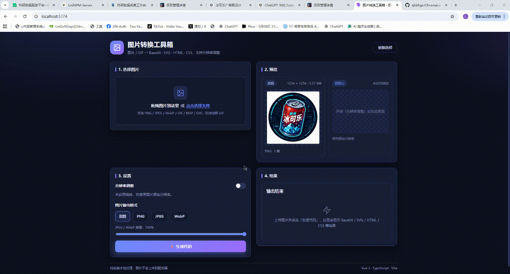

# 图片转换工具箱 (Image Conversion)

一个基于 **Vue 3 + TypeScript + Vite** 的纯前端图片转换工具。

可以将图片 / GIF 转换为 **Base64、SVG、HTML、CSS** 等代码，并支持**分辨率调整**（等比放大 / 缩小，非裁剪）。所有处理均在浏览器本地完成，图片不会上传到服务器。

## 🎬 演示效果

## 📄 开源协议

本项目采用 [CC BY-NC 4.0](https://creativecommons.org/licenses/by-nc/4.0/deed.zh-hans)（知识共享-署名-非商业性使用 4.0 国际）协议。

> 您可以自由使用、修改、分享本项目，但**不得用于商业目的**，且需保留原作者署名。

## 👤 作者

**添碗**
